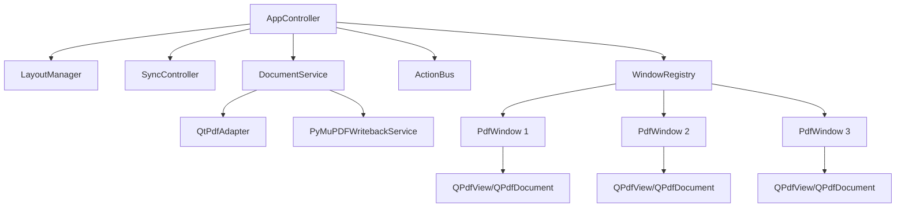

# 技术设计说明 — 多窗口 PDF 对照阅读器（路线 A）

## 1. 目标
使用 **PySide6 + Qt PDF（QPdfView/QPdfDocument）+ PyMuPDF** 构建正式版桌面应用：
- PySide6：UI 与窗口管理。
- Qt PDF：PDF 显示、导航、搜索基础能力。
- PyMuPDF：批注写回、保存新 PDF、后续文档处理扩展。

## 2. 关键技术选型
### 2.1 PySide6 / Qt Widgets
采用 Qt Widgets 而不是 Tkinter，原因：
- 更成熟的桌面窗口管理能力。
- 更适合多窗口、多屏、快捷键、菜单、工具栏。
- 原生支持信号槽模型，便于同步控制。

### 2.2 QPdfView / QPdfDocument
采用 Qt PDF 作为 PDF 显示层，原因：
- 提供原生 PDF 阅读控件。
- 支持 SinglePage / MultiPage 模式。
- 适合构建受控的嵌入式阅读器。

### 2.3 PyMuPDF
采用 PyMuPDF 作为写回层，原因：
- 后续可写入 PDF 批注。
- 适合做保存副本、批注持久化、文档预处理。
- PDF 以外的若干格式也可作为后续扩展来源，但批注写回优先面向 PDF。

## 3. 总体架构


## 4. 核心模块设计
### 4.1 AppController
职责：
- 启动应用。
- 调起文件选择流程。
- 按文件数量创建阅读窗口。
- 初始化默认布局。
- 绑定全局动作与快捷键。

### 4.2 PdfWindow
每个 PDF 对应一个独立窗口。

职责：
- 容纳一个 QPdfView。
- 管理该窗口自己的页码、缩放、旋转、活动状态。
- 响应本地控制（单窗口模式）。
- 向 SyncController 上报状态变化。

建议包含：
- 顶部工具栏
- 页码显示
- 单窗口操作按钮
- 当前模式标识（同步 / 单独）

### 4.3 LayoutManager
职责：
- 获取主屏可用区域。
- 依据窗口数量计算默认布局：
  - 2 窗口：左右平铺。
  - 3 窗口：左中右平铺。
- 执行“恢复默认布局”。

注意：
- 仅控制窗口位置与尺寸。
- 不修改文档缩放与页码。

### 4.4 SyncController
职责：
- 统一上下/左右滚动。
- 统一翻页。
- 统一缩放。
- 统一恢复初始缩放。
- 维护同步模式与单窗口模式。

关键状态：
- mode: sync | single
- active_window_id: Optional[str]
- sync_enabled: bool

### 4.5 DocumentService
职责：
- 加载 PDF。
- 提供页数、元信息。
- 为 Qt PDF 提供文档对象。
- 后续与写回服务衔接。

### 4.6 PyMuPDFWritebackService
职责：
- 后续批注写回。
- 保存导出副本。
- 旋转、注释等持久化支持。

## 5. 关键数据模型
```python
from dataclasses import dataclass
from pathlib import Path
from typing import Optional

@dataclass
class DocumentSession:
    window_id: str
    file_path: Path
    title: str
    page_count: int
    current_page: int = 0
    zoom_factor: float = 1.0
    initial_zoom_factor: float = 1.0
    rotation: int = 0
    is_active: bool = False

@dataclass
class AppState:
    mode: str  # sync | single
    active_window_id: Optional[str]
    window_count: int
```

## 6. 默认布局算法
### 6.1 输入
- 主屏可用区域 `availableGeometry()`
- 窗口数量 N
- 窗口间距 gap
- 边距 margin

### 6.2 输出
- 每个窗口的目标 QRect

### 6.3 规则
- N=2：宽度等分，左右排布。
- N=3：宽度三等分，左中右排布。
- 高度统一使用主屏可用高度减去边距。
- 初次启动和恢复默认布局均调用同一算法。

## 7. 同步控制策略
### 7.1 同步滚动
方案：由 SyncController 向所有 PdfWindow 广播滚动命令。

统一滚动维度：
- vertical delta
- horizontal delta

### 7.2 同步翻页
方案：
- 获取基准页号。
- 对全部窗口执行 page +/- 1。
- 翻页后统一定位到页面顶部。

### 7.3 同步缩放
方案：
- 对全部窗口应用相同缩放倍率步进。
- 初始缩放比例在首次完成默认布局后记录。

### 7.4 单窗口模式
进入条件：
- 点击某窗口。
- 使用该窗口工具栏控件。

退出条件：
- 点击“返回同步”。
- 按 Esc。

## 8. 快捷键设计
### 全局快捷键（同步模式）
- Up / Down / Left / Right：统一滚动
- Page Up / Page Down：统一翻页
- Ctrl+= / Ctrl+-：统一缩放
- Ctrl+0：统一恢复初始缩放
- Esc：返回同步模式
- Ctrl+R：恢复默认布局

### 单窗口快捷键（活动窗口）
- Up / Down / Left / Right：单窗口滚动
- Page Up / Page Down：单窗口翻页
- Ctrl+= / Ctrl+-：单窗口缩放
- Ctrl+0：单窗口恢复初始缩放
- [ / ]：单窗口旋转

## 9. 初始缩放定义
“初始缩放”不是适宽的实时结果，而是：
- 文件首次载入后
- 默认布局已经完成
- 阅读器进入可用状态时
记录下来的该窗口 zoom_factor。

后续恢复初始缩放时：
- 仅恢复 zoom_factor
- 不改变窗口大小
- 不改变页码
- 不改变旋转

## 10. 多屏策略
- 默认仅在主屏进行初始排布。
- 用户可手动拖动窗口到其他显示器。
- 系统不强制接管多屏自动布局。
- 恢复默认布局时，统一召回主屏默认布局。

## 11. 标注与修改扩展设计
### 11.1 UI 层
预留工具：
- 高亮
- 矩形框
- 文本注释
- 便签

### 11.2 写回层
使用 PyMuPDF：
- 打开原始 PDF
- 追加注释对象
- 保存为副本或覆盖（建议默认保存为副本）

### 11.3 设计原则
- 显示层与写回层解耦。
- 不让显示控件直接承担持久化逻辑。

## 12. 扩展到其他文件类型的策略
不在本期实现，但架构预留适配层：
- PDFAdapter
- ImageAdapter
- XpsAdapter
- EpubAdapter

注意：
- 统一阅读框架可以扩展。
- 但批注写回优先定义在 PDF 上。

## 13. 目录建议
```text
pdf_compare_viewer_v2/
├── app/
│   ├── main.py
│   ├── controller/
│   │   ├── app_controller.py
│   │   ├── sync_controller.py
│   │   └── layout_manager.py
│   ├── model/
│   │   └── session.py
│   ├── ui/
│   │   ├── pdf_window.py
│   │   ├── toolbar.py
│   │   └── dialogs.py
│   ├── service/
│   │   ├── document_service.py
│   │   └── writeback_service.py
│   └── adapter/
│       ├── qt_pdf_adapter.py
│       └── pymupdf_adapter.py
├── requirements.txt
└── README.md
```

## 14. 分阶段实施建议
### Phase 1
- 多窗口加载
- 默认布局
- 同步 / 单窗口模式
- 鼠标与键盘同步滚动
- Page Up / Down 翻页
- 统一缩放 / 恢复初始缩放

### Phase 2
- 单窗口旋转
- 页码显示增强
- 恢复默认布局
- 状态栏与错误处理

### Phase 3
- 批注 UI
- PyMuPDF 写回
- 导出副本

### Phase 4
- OCR 锚点 / 步骤号同步
- 搜索联动
- 多格式适配
